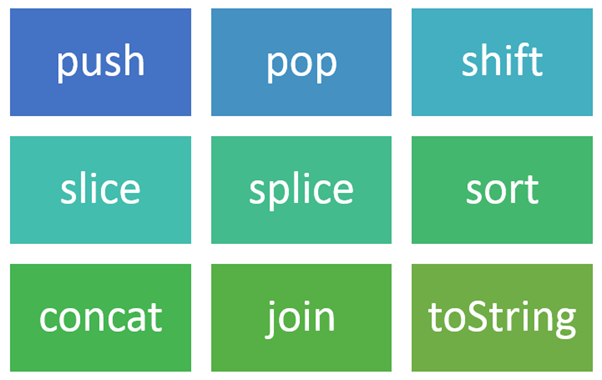

# JavaScript Array - Exercises, Practice, Solution

Using npm and jest, I have created a simple program to give me better understanding of creating a testing program and exposure to JavaScript builtin object Arrays.

Theses exercise grabbed from **[w3resource](https://www.w3resource.com/javascript-exercises/)**.

## Requirements

The User should be able to:

* Have some understanding of JavaScript language.
* Completed first 7 JavaScript chapters on CodeAcademy.
* Get help via Google, Stack Overflow, and GitHub.
* Difference between vanilla JavaScript and ES6 Version.

## Hints

The following method are examples of what you might write tests and complete the code for:

* `call`
* `slice`
* `toString`
* `join`

The .png image grabbed from **[Medium](https://medium.com/@shabeermothi_24117/javascript-array-methods-623f53dcf8bc/)**.
